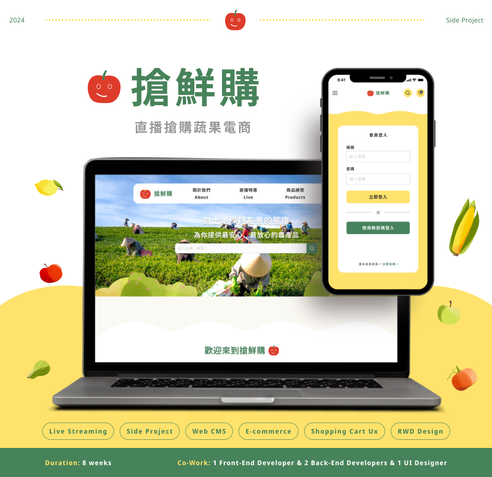

<p align="center">
  <a href="https://sun-live.vercel.app">
    
  </a>
</p>
<h1 align="center" style="font-weight: 700"> 搶鮮購  | SunLive </h1>
<div align="center" style="margin-bottom:24px">

  <a href="https://sun-live.vercel.app">
  專案網址 
  </a>
  <span>｜</span>
  <a href="https://github.com/JHANGMING/SunLive">
   前端 Github Repo 
  </a>
  <span>｜</span>
  <a href="https://github.com/David07994415/RocketFarmerProject">
    後端 Github Repo 
  </a>
  <span>｜</span>
  <a href="https://liberating-dosa-c89.notion.site/a3098fd6c4a54711b28e87a9bac99dcb?v=4b9aa8addad2438389aaa9aa3dd61b1b&p=e20c4039a92d4e3a970ced34e004e791&pm=s&pvs=31">
  API 文件
  </a>
<p>
</p>
<p>
搶鮮購是探索有機農產品的理想平台<br>
致力於協助小農推廣並販售有機農作物，
透過即時直播和搶購功能，
讓用戶更深入了解每個美味的背後故事。
</p>

</div>
<hr/>


## 功能介紹

> 註冊之後可以依據所選擇的身份分為「一般會員」及「小農」角色

### ► 一般會員角色 (Customer)

- 註冊/登入

- 查看商品、直播列表

- 查看商品細節資訊

- 特定產品加入或移除購物車

- 編輯購物車商品數量、規格

- 搜尋特定產品

- 與小農(商家)進行1對1即時聊天

- 觀看直播並進行多對多即時聊天

- 進行購物車結帳

- 個人帳號資訊設定與編輯

- 查詢所有訂單

  

### ► 小農角色 (Farmer)

  
- 註冊/登入

- 個人帳號資訊設定與編輯

- 建立與修改農產品資訊

- 建立與修改直播串流資訊

- 察看與管理訂單狀態(包含出貨狀態調整)

- 與一般會員角色(客戶)進行1對1即時聊天

- 主持直播間並進行多對多即時聊天
<hr/>

## 建議體驗流程

  

- 一般會員 (Customer)

      1. 於首頁搜尋有興趣的農產品，並點選 `特定產品`  (轉跳至該產品細節頁)

      2. 選擇產品規格並點選 `立即購買` 按鈕 (轉跳至結帳頁面)

      3. 填寫收貨人資料欄位，並點擊 `確認付款` 按鈕  (轉跳至藍新金流頁面)

      4. 於藍新金流頁面，選擇 Web ATM 方式進行結帳  (轉跳至藍新金流頁面)

      5. 點選 `查看訂單詳情` 按鈕 (轉跳至所有訂單頁面)

- 小農 (Farmer)

      1. 查看左側選單`直播設定` 欄位，點選 `直播設定` 按鈕 (轉跳至直播設定頁面)

      2. 填寫直播設定資料欄位，並選擇直播農產品，再點擊 `儲存` 按鈕  (轉跳至所有直播頁面)

      3. 針對剛才新增的直播場次，於 `聊天室置頂商品` 欄位，選擇與調整置頂商品

      4. 前往前台 `直播特惠` 頁面，瀏覽 `近期直播` 直播場次

<hr/>

## 資料夾結構
```flow
sunlive/
├── public
│   ├── favicon.ico
│   └── images
│       ├── auth
│       ├── cart
│       └── ...
├── src
│   ├── common
│   │   ├── components
│   │   │   ├── Button
│   │   │   ├── CustomHead
│   │   │   └── ...
│   │   ├── helpers
│   │   │   ├── fetchApi.tsx
│   │   │   ├── fetchAuthStatus.tsx
│   │   │   └── ...
│   │   ├── hooks
│   │   │   ├── ProductsRefContext.tsx
│   │   │   ├── useAuth.tsx
│   │   │   └── ...
│   │   └── lib
│   │       ├── authTab.tsx
│   │       └── cartTab.tsx
│   ├── constants
│   │   ├── apiPaths.tsx
│   │   ├── location.tsx
│   │   └── types
│   │       ├── cart
│   │       ├── dashboard
│   │       └── ...
│   ├── modules
│   │   ├── Auth
│   │   ├── CartPage
│   │   └── ...
│   ├── pages
│   │   ├── 404.tsx
│   │   ├── 500.tsx
│   │   ├── _app.tsx
│   │   ├── _document.tsx
│   │   ├── index.tsx
│   │   ├── api
│   │   │   ├── auth
│   │   │   ├── cart
│   │   │   └── ...
│   ├── redux
│   │   ├── features
│   │   │   ├── authSlice.tsx
│   │   │   ├── cartSlice.tsx
│   │   │   └── ...
│   │   └── store.tsx
│   └── styles
│       ├── globals.scss
│       ├── header.scss
│       └── ...
├── tailwind.config.ts
├── README.md
├── next-env.d.ts
├── next.config.js
├── package-lock.json
├── package.json
├── postcss.config.js
└── tsconfig.json
```
---

## 專案技術 

<h2 align="center">前端技術</h2>
<p>
  
  
  
  
  
  
  
  
  
  
  
  


### 技術說明：

* 開發環境：Next.js
    * 使用Next.js的SSR，可以在伺服器上完整渲染 HTML 頁面，除了有更好的 SEO 和更快的頁面加載速度，同時預先渲染的頁面，提升使用者體驗。

* 使用框架：React
    * 使用React進行前端開發，利用React的生態系來快速搭建網站並搭配生命週期特性讓網站狀態管理更加高效，進而提升用戶體驗。

* 語言：TypeScript
    * 開發過程中採用TypeScript語言，其強類型特性有效預防了許多常見錯誤，並且在元件中減少了因型別錯誤導致的衝突。

* CSS：Tailwind
    * 使用Tailwind來進行CSS的開發，通過提供大量預定義的類別來幫助開發者快速構建和設計界面，減少冗餘代碼。

* 雲端伺服器：Vercel
    * 選擇Vercel來進行部署，提供高度的穩定性和優化的整合體驗，實現快速的自動化部署流程，簡化開發到上線的過程。
</p>

<h2 align="center">後端技術</h2>
 <p>
  
  
  
  
  
  
  
  
  

  ### 技術說明：

* 開發環境：Microsoft Visual Studio
    * 使用的是 .net Freamwork 平台，版本為4.7.2。

* 使用框架：ASP .NET Web API 2
    * 支持RESTful服務的開發。裡面包含GET、POST、PUT、DELETE等。

* 資料庫：Microsoft SQL Server
    * 關聯性資料庫管理系統，用於記錄數據、查詢資料等。

* 技術：SignalR
    * 此為Microsoft所開發的套件，針對即時通訊應用提供包裹性解決方案。

* 雲端伺服器：Azure
    * Microsoft提供一個雲端平台，選擇虛擬機台進行後端伺服器資源部署。

</p>

<h2 align="center">UI/UX端</h2>
 <p>
  
  
  
  
  
   
  

  ### 工具說明：

* 線搞圖/設計圖：Figma
    * 製作 Wireframe、線稿圖及 Prototype。
    * 優化團隊合作與溝通，使成員能夠清晰掌握產品的設計理念和用戶體驗路徑。

* 繪圖工具：Illustrator
   - 繪製 logo 圖案。
   - 多樣的編輯工具，精確控制圖案的每個細節。
</p>